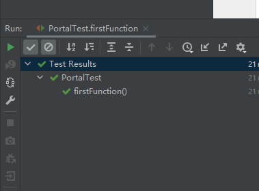
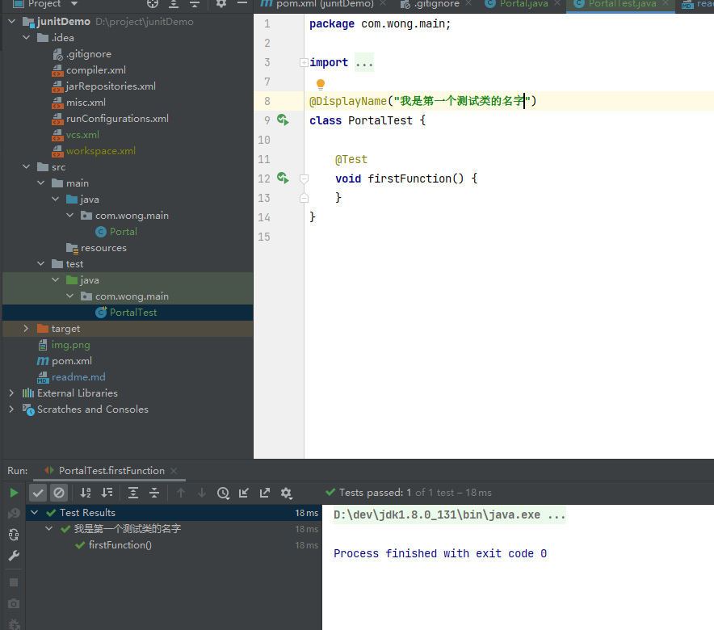
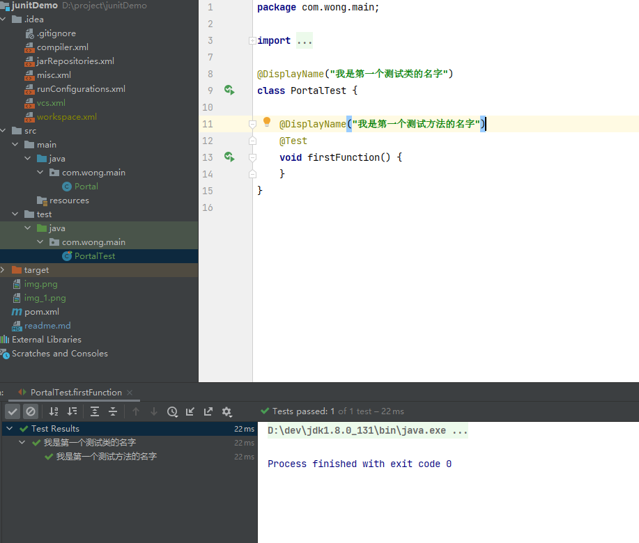

#junit demo 记录

## 1、引入junit5依赖
    <dependency>
    <groupId>org.junit.jupiter</groupId>’
    <artifactId>junit-jupiter-engine</artifactId>
    <version>5.5.2</version>
    <scope>test</scope>
    </dependency>
    <build>
        <plugins>
		  <plugin>
			<groupId>org.apache.maven.plugins</groupId>
			<artifactId>maven-surefire-plugin</artifactId>
			<version>3.0.0-M3</version>
		</plugin>
	</plugins>
    </build> 
## 2、注解
### 2.1 @DisplayName
  自定义显示名称 ，可以包含空格，特殊字符，甚至是表情符号 ，自定义名称将由测试运行者和测试报告显示。 \
####默认的显示名称
\
####自定义类名称

####自定义方法名称

